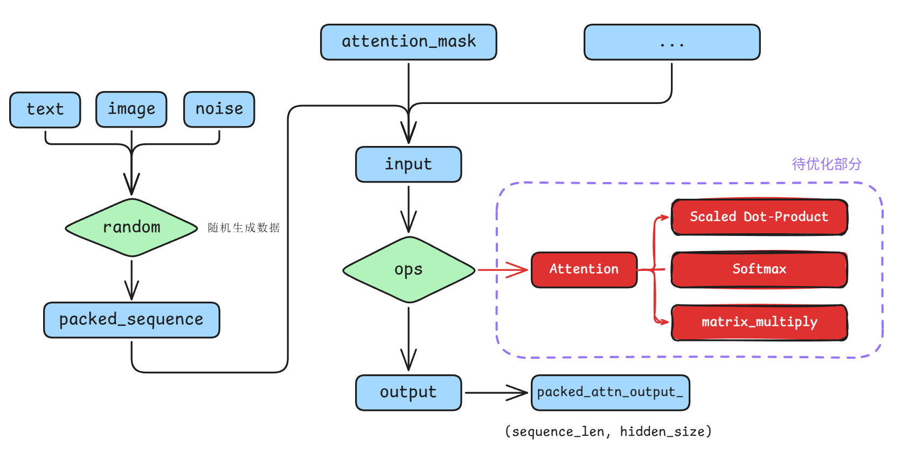
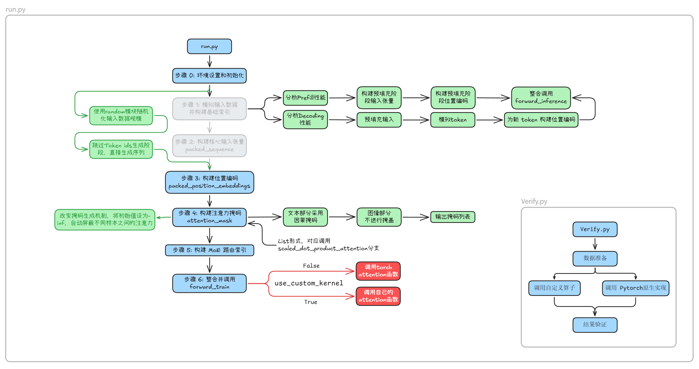
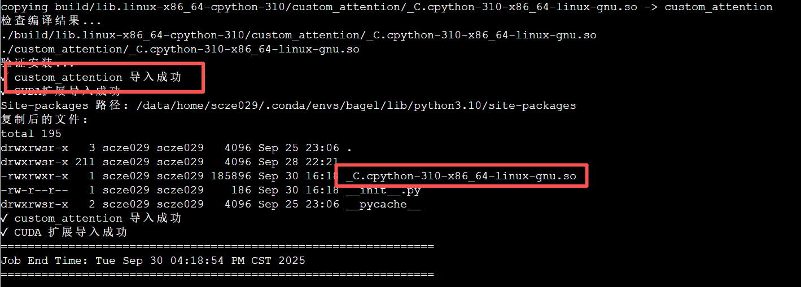
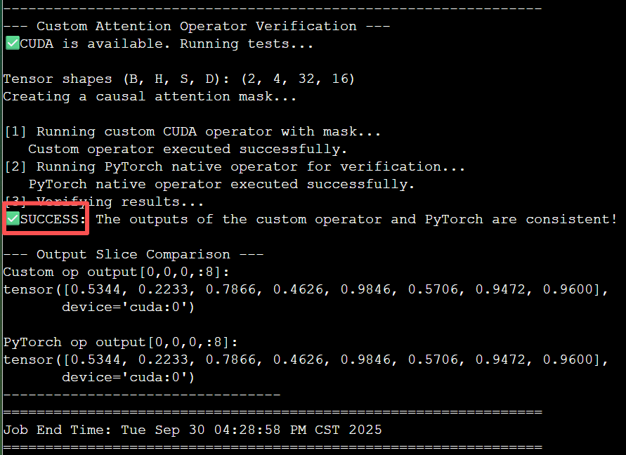
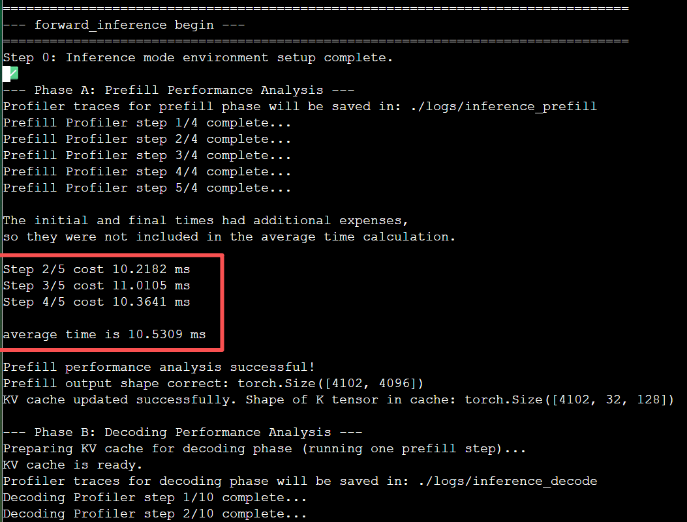

# 背景描述

自“Attention Is All You Need”发布以来，Transformer架构以其革命性的自注意力机制，彻底重塑了人工智能领域。它不仅解决了传统模型在处理长序列信息时的瓶颈，还为之后的大模型爆发增长奠定了基础。我们今天所见证的、以GPT和Sora为代表的AIGC浪潮，其技术源头都可以追溯到Transformer。然而，这些智能模型涌现的背后，是对庞大算力的极致运用。在训练阶段，模型需要处理万亿级的数据并迭代优化数千亿参数；在推理阶段，要以极低延迟响应全球用户的并发请求，同样需要强大的并行计算能力。这种需求催生了高性能计算（HPC）与AI的深度融合。HPC以大规模并行计算为核心，通过协同数千个处理器，将复杂问题分解为可同时处理的简单任务，从而将原本需要数十年才能完成的训练过程缩短至数月，为整个AI领域的发展提供了核心动力。

在Transformer架构的所有组件中，注意力（Attention）算子是当之无愧的“认知核心”，但同时也是最大的“计算瓶颈”。它通过计算查询（Query）、键（Key）和值（Value）之间的关系，赋予了模型动态聚焦关键信息的能力。这种能力的代价是巨大的计算量，其复杂度会随着序列长度的增加而呈平方级增长。尤其是在像Bagel这样的多模态模型中，需要处理的序列往往更长、更复杂，Attention算子的运行效率直接决定了整个模型的训练和推理速度。因此，对Attention算子进行深度优化，是提升大模型性能的关键所在。

对于大模型训练而言，每一毫秒的性能优化都具有实际价值。在数千块GPU上运行数周的训练任务中，这些微小的提升在经过大规模、长时间的累积后，都将转化为训练时间和能源成本上的显著节约，对于加速模型迭代和推动技术边界具有至关重要的行业价值。本次挑战的核心，是让你从理论走向实践，亲手优化Attention核心算子。你将获得的不仅是算法知识，更是解决真实世界中计算效率问题的宝贵经验，这种能力将是你在AI工程领域脱颖而出的有力证明。

# 题目说明

题目基于字节跳动开源多模态模型Bagel的forward_train部分，选手需要在保证输出结果正确性通过验证的情况下，手动编写高性能attention算子合并到函数调用中，实现缩减训练时间的目标。

现已为选手搭建好 custom operator 集成模块，核心可修改部分为 `multimodal/` 下的 `custom_kernel/custom_attention/custom_attention.cu`



<!-- <div style="text-align: center;">  </div> -->

## 项目结构

```Shell
multimodal/
├── bagel_mot_attention.py                 # 多模态程序               
├── custom_kernel                          # 自定义 kernel 文件夹
│   ├── custom_attention                   # 自定义函数库
│   │   ├── binding.cpp                    # 前后端绑定函数
│   │   ├── custom_attention.cu            # 自定义 CUDA 函数
│   │   ├── __init__.py                    # 初始化文件
│   ├── logs                               # 任务输出日志
│   ├── run.sh                             # 自定义函数运行脚本
│   ├── setup.py                           # 自定义函数构建脚本
│   └── verify.py                          # 自定义函数验证脚本
├── logs                                   # 任务输出日志
├── README.md                              # （目前是构建初始环境的命令）
├── requirements.txt                       # conda 依赖项目录
├── run.py                                 # 算子性能测试脚本
├── run.sh                                 # 任务提交脚本
└── verify.py                              # 算子正确性验证脚本
```

项目主要分为是自定义函数库以及顶层项目文件两个部分

### 自定义函数库

`custom_kernel`：自定义函数库部分，该部分使用setup方法导入并使用自建算例。

`custom_attention.cu`：存放 native attention kernel，即选手需要进行修改优化部分

`binding.cpp`：作为 python 和 CUDA 链接的程序，定义python端的调用方式

`__init__.py`：用于识别函数库入口以及进行初始设置

### 程序运行及验证部分

`run.sh`：集群任务提交脚本，实际运行 `run.py` / `verify.py` 脚本

`verify.py`：算子正确性验证脚本，在相同数据集输入情况下对比 custom ops 与 Pytorch 原生算子的运算结果，进行正确性验证

`run.py`：代码性能测试脚本，通过装饰器以及 torch.profiler 两种方式进行性能测试。装饰器计时部分在任务输出日志中可以直观获得，torch.profiler 计时数据保存在 `/log/` 下的指定文件夹中



<!-- <div style="text-align: center;">  </div> -->
<!-- <center><font style="font-size: 80%;">run.py 及 verify.py 代码结构</center> -->

## 操作流程

### 登陆集群

清华同学：通过 [清华专属算例--并行科技](https://easycompute.cs.tsinghua.edu.cn/login) 领取 500 元代金券，进入[并行智算云](https://ai.paratera.com/#/container/instance)，选择“集群”进行集群资源申请，选择 RTX4090 即可。登入后点击“SSH”连接集群。

### 获取代码仓库

```Shell
git clone https://github.com/KnowingNothing/OpenKernel.git
```

### 环境配置

集群使用 module 工具管理开发环境。我们推荐使用 conda(miniforge) 管理你的 python 环境。你可能需要的命令有：

`module load miniforge3/24.11` 加载 conda 环境

`conda create -n bagel python=3.10 -y` 创建一个名为 bagel 的环境

`conda activate bagel` 激活 bagel 环境

（在 multimodal 目录下）`pip install -r requirements.txt` 下载相关依赖

`module load cuda/12.4` 加载 CUDA 环境

### 编译自定义函数库

注意，每当你修改自定义函数后，都应重新编译自定义函数库。

为了保证编译环境和运行环境一致，这里需要利用脚本提交到计算节点进行编译。而集群的计算节点不能联网，因此可以选择一种简单粗暴的方法：不适用 pip，直接编译出来 .so 文件，然后手动把它们复制到 conda 环境中。

参考脚本：`custom_kernel/run.sh`

```shell
#!/bin/bash
#SBATCH --job-name=compile_custom_op
#SBATCH --output=./logs/compile_custom_op_%j.out
#SBATCH --error=./logs/compile_custom_op_%j.err
#SBATCH --partition=gpu
#SBATCH --time=00:30:00
#SBATCH --nodes=1
#SBATCH --cpus-per-task=6
#SBATCH --ntasks-per-node=1

# Note! Do not load a python environment when running the script, because one is already installed in conda.
# Loading another one will cause environment conflicts.
echo "================================================================"
echo "Job ID: $SLURM_JOB_ID, Running on node: $(hostname), Start Time: $(date)"
echo "================================================================"

echo "Loading CUDA module..."
module load cuda/12.4

echo "Activating Conda environment: bagel..."
# Activate conda
CONDA_BASE=$(conda info --base)
source "$CONDA_BASE/etc/profile.d/conda.sh"
conda activate bagel
python -c "import torch; print(torch.__version__); print(torch.cuda.is_available())"


echo "Conda Environment: $CONDA_DEFAULT_ENV"
echo "CUDA_HOME Environment Variable: $CUDA_HOME"
echo "nvcc Path: $(which nvcc)"
echo "Python Path: $(which python)"
echo "----------------------------------------------------------------"


# 设置 PyTorch 库路径
export LD_LIBRARY_PATH=$CONDA_PREFIX/lib:$LD_LIBRARY_PATH
export LD_LIBRARY_PATH=$CONDA_PREFIX/lib/python3.10/site-packages/torch/lib:$LD_LIBRARY_PATH

# 检查 PyTorch 库路径
echo "检查 PyTorch 库路径..."
find $CONDA_PREFIX -name "libc10.so" 2>/dev/null

export TORCH_CUDA_ARCH_LIST="8.9"

echo "----------------------------------------------------------------"
echo "开始编译CUDA扩展..."

# 清理之前的编译
rm -rf build custom_attention/_C*.so

# 直接使用setup.py编译（避免pip的网络请求）
# cd /data/run01/scze029/OpenKernel/challenges/multimodal/custom_kernel
python setup.py build_ext --inplace

echo "检查编译结果..."
find . -name "*.so" -o -name "_C.*.so"

echo "验证安装..."
python -c "
try:
        import custom_attention
        print('✓ custom_attention 导入成功')
        import custom_attention._C
        print('✓ CUDA扩展导入成功')
except Exception as e:
        print('✗ 导入失败:', e)
        import traceback
        traceback.print_exc()
"

# 找到 conda 环境的 site-packages 路径
SITE_PACKAGES=$(python -c "import site; print(site.getsitepackages()[0])")
echo "Site-packages 路径: $SITE_PACKAGES"

# 创建目标目录
mkdir -p $SITE_PACKAGES/custom_attention

# 复制 Python 文件
cp custom_attention/__init__.py $SITE_PACKAGES/custom_attention/

# 复制编译好的 .so 文件
# 查找所有可能的 .so 文件位置
find . -name "_C*.so" -exec cp {} $SITE_PACKAGES/custom_attention/ \;

# 如果上面的命令没找到，尝试这些可能的位置
cp build/lib.linux-x86_64-cpython-310/custom_attention/_C*.so $SITE_PACKAGES/custom_attention/ 2>/dev/null || true
cp custom_attention/_C*.so $SITE_PACKAGES/custom_attention/ 2>/dev/null || true

# 检查复制结果
echo "复制后的文件:"
ls -la $SITE_PACKAGES/custom_attention/

# 检验是否可以在任意目录下使用
cd ..
python -c "
try:
        import custom_attention
        print('✓ custom_attention 导入成功')
        import custom_attention._C
        print('✓ CUDA 扩展导入成功')
except Exception as e:
        print('✗ 在其他目录下导入失败:', e)
"
cd custom_kernel

echo "================================================================"
echo "Job End Time: $(date)"
echo "================================================================"
```

运行方式：进入到 `custom_kernel` 目录，然后运行 `sbatch --gpus=1 run.sh`



#### 自定义算子正确性验证和运行时间测试

运行脚本示例：`run.sh`

```shell
#!/bin/bash
#----------------------------------------------------------
# SBATCH Directives
#----------------------------------------------------------
#SBATCH --job-name=run_bagel
#SBATCH --output=./logs/run_bagel_%j.out
#SBATCH --error=./logs/run_bagel_%j.err
#SBATCH --gpus=1
#SBATCH --time=00:30:00
#SBATCH --nodes=1
#SBATCH --cpus-per-task=4
#SBATCH --ntasks-per-node=1

# Note! Do not load a python environment when running the script, as one is already installed in conda. Loading another will cause environment conflicts.
echo "================================================================"
echo "Job ID: $SLURM_JOB_ID, Running on node: $(hostname), Start Time: $(date)"
echo "================================================================"

# The spack load command will automatically set environment variables like PATH and CUDA_HOME
echo "Loading CUDA module..."
# spack load cuda@12.4.1
module load cuda/12.4

# Activate Conda environment
echo "Activating Conda environment: bagel..."
CONDA_BASE=$(conda info --base)
source "$CONDA_BASE/etc/profile.d/conda.sh"
conda activate bagel

# Print environment variables (for debugging)
echo "Conda Environment: $CONDA_DEFAULT_ENV"
echo "CUDA_HOME Environment Variable: $CUDA_HOME"
echo "nvcc Path: $(which nvcc)"
echo "Python Path: $(which python)"
echo "----------------------------------------------------------------"


export LD_LIBRARY_PATH=$CONDA_PREFIX/lib:$CONDA_PREFIX/lib/python3.10/site-packages/torch/lib:$LD_LIBRARY_PATH
export PYTHONPATH=$(pwd):$PYTHONPATH

# python verify.py
python run.py

echo "================================================================"
echo "Job End Time: $(date)"
echo "================================================================"
```

通过修改 multimodal 下的 `run.sh` 脚本，将其中的最终运行命令替换为`python verify.py`并提交运行：`sbatch --gpus=1 run.sh`，可以验证自定义算子正确性。



> 可以在 `run.py` 文件中通过设置 `USE_CUSTOM_KERNEL`变量的布尔值，在 **Pytorch 实现** 与 **自定义实现** 之前切换对象

修改 `multimodal` 下的 `run.sh` 脚本，将其中的最终运行命令替换为 `python run.py` 并提交运行： `sbatch --gpus=1 run.sh`，可以获取运行时间：



`python run.py` 执行后会在`./logs/train`下输出对应的采样文件

# 参考文献

导入并使用自建函数库：[https://docs.pytorch.ac.cn/tutorials/advanced/cpp_custom_ops.html](https://docs.pytorch.ac.cn/tutorials/advanced/cpp_custom_ops.html)

Attention Is All You Need ：[https://arxiv.org/abs/1706.03762](https://arxiv.org/abs/1706.03762)

bagel开源仓库：[https://github.com/bytedance-seed/BAGEL](https://github.com/bytedance-seed/BAGEL)
